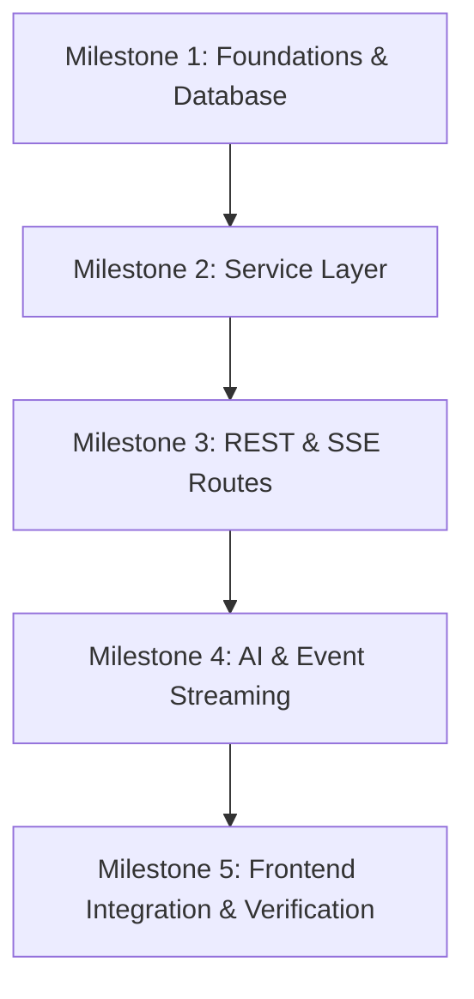

# JARVIS AI Operating System - Backend Architecture Specification

This document provides the complete, production-grade technical planning and architectural specification for the **JARVIS AI Operating System** backend.

---

## 1. Architecture Review

### Critique of Initial Specifications & Express Prototype
1. **Coupled Business Logic in API Layer**: In the Express prototype (`server.ts`), the API endpoints directly invoke the Gemini client and manage streaming. This breaks Single Responsibility. A production FastAPI backend must segregate route controllers from core services.
2. **Synchronous File Operations / Blocking Calls**: Node's runtime handles async requests via its event loop, but the initial spec lacked non-blocking database layers. In Python, utilizing a synchronous DB driver (like standard SQLite) blocks the event loop. We must enforce asynchronous DB drivers (`aiosqlite`) to avoid blocking thread pools.
3. **Database Write Locks in SQLite**: SQLite only allows one write operation at a time. Under async concurrency, multiple writes can cause `sqlite3.OperationalError: database is locked`. We mitigate this by enabling Write-Ahead Logging (WAL) and wrapping sessions in appropriate transaction blocks.
4. **WebSocket vs SSE Complexity**: The original spec requested WebSockets for all real-time events. However, WebSockets require keep-alives, handle reconnection poorly compared to Server-Sent Events (SSE), and bypass HTTP cache structures. Our chosen hybrid model uses REST for CRUD and SSE for unidirectional real-time streams (chat streaming and notification events), reducing protocol overhead.
5. **No Database Authentication Table**: In line with the user preference, authentication will bypass database-level username/password tables and instead perform token validation against an environment variable password (e.g. `JARVIS_PASSWORD`). This simplifies single-user local deployment.

---

## 2. Improved Logic Specification

### Request & Core Processing Pipeline
Every user objective undergoes a systematic processing pipeline:
1. **Request Intake**: Received via HTTP POST or WebSocket.
2. **Context Assembly**: The `ContextBuilder` aggregates:
   - System Prompts & Application Rules
   - User Preferences (from config/settings)
   - Project Summary (from database)
   - Active File Metadatas
   - Selected Conversational History (last $N$ messages)
3. **Intent Extraction & Dispatch**: The `Orchestrator` determines whether the prompt implies a task or a simple conversational query. If it is a task, it generates a `TaskCreated` event.
4. **AI Generation**: Dispatched to the `AIService` wrapping the `google-genai` client.
5. **Stream Publication**: Text tokens are pushed to the in-memory event bus.
6. **Streaming Endpoint consumption**: The SSE route listens to the bus and pushes data blocks to the React frontend.
7. **Post-Completion Hook**: The database is updated, chat titles auto-generate if generic, and summaries are updated asynchronously.

```
       [User Request]
             │
             ▼
     [ContextBuilder] ◄─── [DB / Files / Preferences]
             │
             ▼
      [AIService] ───────► [Gemini API]
             │
             ▼
     [Event Broker] ──────► [SSE Client Stream]
             │
             ▼
   [Async Update Hooks] ──► [DB Persistence]
```

---

## 3. Improved MVP Specification

### Scope Boundaries
* **In Scope**:
  - FastAPI async API layer.
  - SQLite backend database with `aiosqlite` and SQLAlchemy 2.0.
  - SSE streaming for chat response tokens and task progress notifications.
  - Multi-project workspace structure.
  - Local file uploads stored in `.storage/uploads` inside the workspace.
  - Local memory store (structured context, summaries, notes).
  - Simple environmental password auth.
* **Out of Scope**:
  - Multi-user ACLs (Access Control Lists).
  - Multi-tenant cloud deployments.
  - Browser automation, MCP server integrations, and autonomous agents (these are designated for Post-MVP).

### Acceptance Criteria
- **Latency**: SSE chat stream response begins in $< 1.5$ seconds.
- **Reliability**: Zero database locking errors under 10 concurrent requests.
- **Completeness**: Data persists after system reboots.
- **Security**: Prevent path-traversal attacks on file uploads.

---

## 4. Master Product Requirements Document

### Data Flow & Entities
JARVIS coordinates projects, chats, messages, files, memories, tasks, and settings.
- **Projects**: The core grouping node. All objects reference a `project_id`.
- **Chats**: Conversational threads inside a project.
- **Messages**: Individual prompts and responses with token and latency tracking.
- **Tasks**: Long-running or conversational actions tracker.
- **Files**: Metadatas of items stored locally.
- **Memories**: Pinned summaries, manual notes, and key facts.

---

## 5. Backend Architecture Specification

### Directory Structure
```text
backend/
├── alembic/              # DB migration files
├── src/
│   ├── api/              # REST & SSE routers
│   │   ├── auth.py
│   │   ├── chats.py
│   │   ├── files.py
│   │   ├── memories.py
│   │   ├── projects.py
│   │   ├── settings.py
│   │   └── tasks.py
│   ├── core/             # Settings, DB session, event bus
│   │   ├── config.py
│   │   ├── database.py
│   │   └── events.py
│   ├── models/           # SQLAlchemy schemas
│   │   ├── base.py
│   │   ├── chat.py
│   │   ├── file.py
│   │   ├── memory.py
│   │   ├── project.py
│   │   └── task.py
│   ├── schemas/          # Pydantic validation models
│   │   ├── chat.py
│   │   ├── file.py
│   │   ├── memory.py
│   │   ├── project.py
│   │   ├── settings.py
│   │   └── task.py
│   ├── services/         # Core business logic
│   │   ├── ai.py
│   │   ├── chat.py
│   │   ├── file.py
│   │   ├── memory.py
│   │   ├── project.py
│   │   └── task.py
│   ├── main.py           # FastAPI initialization
│   └── dependencies.py   # FastAPI DI setup
├── .env                  # Local configurations
└── requirements.txt      # Dependencies
```

---

## 6. Database Specification

### Tables & Relationships (SQLAlchemy)

#### 1. Projects Table (`projects`)
- `id`: VARCHAR(36) (Primary Key, UUID)
- `name`: VARCHAR(255) (Not Null)
- `description`: TEXT
- `icon`: VARCHAR(50)
- `color`: VARCHAR(7) (Hex color code)
- `created_at`: TIMESTAMP (Default: UTC NOW)
- `updated_at`: TIMESTAMP (Default: UTC NOW)

#### 2. Chats Table (`chats`)
- `id`: VARCHAR(36) (Primary Key, UUID)
- `project_id`: VARCHAR(36) (Foreign Key -> projects.id, ON DELETE CASCADE, **Indexed**)
- `title`: VARCHAR(255)
- `summary`: TEXT
- `created_at`: TIMESTAMP
- `updated_at`: TIMESTAMP

#### 3. Messages Table (`messages`)
- `id`: VARCHAR(36) (Primary Key, UUID)
- `chat_id`: VARCHAR(36) (Foreign Key -> chats.id, ON DELETE CASCADE, **Indexed**)
- `role`: VARCHAR(50) (e.g., 'user', 'model')
- `content`: TEXT (Not Null)
- `token_count`: INTEGER
- `latency`: FLOAT (seconds)
- `created_at`: TIMESTAMP

#### 4. Files Table (`files`)
- `id`: VARCHAR(36) (Primary Key, UUID)
- `project_id`: VARCHAR(36) (Foreign Key -> projects.id, ON DELETE CASCADE, **Indexed**)
- `filename`: VARCHAR(255) (Not Null)
- `path`: VARCHAR(1024) (Relative storage path)
- `size`: INTEGER (bytes)
- `mime_type`: VARCHAR(100)
- `created_at`: TIMESTAMP

#### 5. Tasks Table (`tasks`)
- `id`: VARCHAR(36) (Primary Key, UUID)
- `project_id`: VARCHAR(36) (Foreign Key -> projects.id, ON DELETE CASCADE, **Indexed**)
- `chat_id`: VARCHAR(36) (Optional, Foreign Key -> chats.id)
- `status`: VARCHAR(50) (e.g., 'queued', 'running', 'completed', 'failed')
- `title`: VARCHAR(255) (Not Null)
- `description`: TEXT
- `logs`: TEXT
- `started_at`: TIMESTAMP
- `finished_at`: TIMESTAMP

#### 6. Memories Table (`memories`)
- `id`: VARCHAR(36) (Primary Key, UUID)
- `project_id`: VARCHAR(36) (Foreign Key -> projects.id, ON DELETE CASCADE, **Indexed**)
- `title`: VARCHAR(255)
- `content`: TEXT
- `importance`: INTEGER (1-10 priority indicator)
- `created_at`: TIMESTAMP

#### 7. Settings Table (`settings`)
- `key`: VARCHAR(255) (Primary Key)
- `value`: TEXT (JSON serialized value)

### Performance Tuning: Indexing Strategies
To achieve "lightning-fast / near-instant" query execution, foreign keys are explicitly indexed to optimize common relational filters and table joins:
- `ix_chats_project_id` on `chats(project_id)`
- `ix_messages_chat_id` on `messages(chat_id)`
- `ix_files_project_id` on `files(project_id)`
- `ix_tasks_project_id` on `tasks(project_id)`
- `ix_memories_project_id` on `memories(project_id)`

### Database Configuration (SQLite WAL Mode)
```python
from sqlalchemy.ext.asyncio import create_async_engine, AsyncSession
from sqlalchemy.orm import sessionmaker
from sqlalchemy import event

DATABASE_URL = "sqlite+aiosqlite:///./.storage/jarvis.db"

engine = create_async_engine(
    DATABASE_URL,
    connect_args={"check_same_thread": False},
)

# Enable WAL mode on connect for concurrent read/write optimization
@event.listens_for(engine.sync_engine, "connect")
def set_sqlite_pragma(dbapi_connection, connection_record):
    cursor = dbapi_connection.cursor()
    cursor.execute("PRAGMA journal_mode=WAL")
    cursor.execute("PRAGMA synchronous=NORMAL")
    cursor.execute("PRAGMA foreign_keys=ON")
    cursor.close()

AsyncSessionLocal = sessionmaker(
    bind=engine,
    class_=AsyncSession,
    expire_on_commit=False
)
```

---

## 7. API Specification

### Rest & SSE Endpoints

#### Authentication (Env Password Auth)
- `POST /api/auth/login`: Accepts JSON `{password}`. Returns `{access_token}` if password matches env config.
- `GET /api/auth/session`: Validates current request headers containing Bearer token.

#### Projects Router
- `GET /api/projects`: List all projects.
- `POST /api/projects`: Create a project.
- `PATCH /api/projects/{id}`: Update meta parameters.
- `DELETE /api/projects/{id}`: Deletes project.

#### Chat & Stream Router
- `GET /api/chats/{project_id}`: List all chats inside a project.
- `POST /api/chats`: Create a new chat.
- `DELETE /api/chats/{id}`: Delete chat history.
- `POST /api/chats/stream`: SSE response stream endpoint.
  - **Request**: JSON payload containing `chat_id`, `message`, `systemInstruction`, `model`, `useSearch`.
  - **Response**: `text/event-stream` sending lines formatted as:
    `data: {"text": "chunk text", "searchChunks": [...]}`
    `data: [DONE]`

#### Files Router
- `POST /api/files/upload`: Form-data upload endpoint.
- `DELETE /api/files/{id}`: Delete physical file and metadata.

#### Tasks Router
- `GET /api/tasks/{project_id}`: List tasks.
- `POST /api/tasks`: Create a manual or system task.
- `PATCH /api/tasks/{id}`: Update status/logs.

---

## 8. Event System Specification

### In-Memory Async Event Broker
We use an in-memory Pub/Sub broker using asyncio queues.
```python
import asyncio
from typing import Dict, List, Callable, Any

class EventBroker:
    def __init__(self):
        self._subscribers: Dict[str, List[Callable[[Any], asyncio.Task]]] = {}

    def subscribe(self, event_type: str, handler: Callable[[Any], Any]):
        if event_type not in self._subscribers:
            self._subscribers[event_type] = []
        self._subscribers[event_type].append(handler)

    async def publish(self, event_type: str, data: Any):
        if event_type in self._subscribers:
            for handler in self._subscribers[event_type]:
                if asyncio.iscoroutinefunction(handler):
                    asyncio.create_task(handler(data))
                else:
                    handler(data)

event_broker = EventBroker()
```

---

## 9. Service Specification

- **ProjectService**: Manages project workspaces. CRUD operations.
- **ChatService**: Manages chat database models, history pagination, and automatic chat renaming.
- **FileService**: Manages upload validations, file size constraints ($50\text{MB}$ limit), physical file deletions, and folder structures under `.storage/uploads/`.
- **TaskService**: Spawns background operations, handles state transitions, and pushes task updates to the event broker.
- **MemoryService**: Processes conversational summaries, extracts core details from completions, and stores pinned facts.
- **AIService**: Manages the interface with Google Gemini.

---

## 10. Gemini Integration Specification

### Modern `google-genai` Python SDK Setup
We initialize the modern SDK client:
```python
from google import genai
from google.genai import types

class AIService:
    def __init__(self, api_key: str):
        self.client = genai.Client(api_key=api_key)

    async def stream_chat(
        self,
        prompt: str,
        history: List[Dict[str, str]],
        system_instruction: str,
        model: str = "gemini-3.5-flash",
        use_search: bool = False
    ):
        contents = []
        for msg in history:
            role = "user" if msg["role"] == "user" else "model"
            contents.append(types.Content(
                role=role,
                parts=[types.Part.from_text(text=msg["content"])]
            ))
        contents.append(types.Content(role="user", parts=[types.Part.from_text(text=prompt)]))

        config = types.GenerateContentConfig(
            system_instruction=system_instruction,
            temperature=0.7,
        )
        if use_search:
            config.tools = [types.Tool(google_search=types.GoogleSearch())]

        # Async generator interface wrapper
        response_stream = await self.client.aio.models.generate_content_stream(
            model=model,
            contents=contents,
            config=config
        )
        
        async for chunk in response_stream:
            yield chunk
```

---

## 11. Security Specification

1. **Path Traversal Protection**: File operations must validate path targets using `pathlib.Path.resolve()` to ensure they remain inside `.storage/uploads/`.
2. **Input Sanitization**: Block executable payloads and sanitize filenames before persisting.
3. **Environment Isolation**: Never expose `GEMINI_API_KEY` or `JARVIS_PASSWORD` to the client logs.

---

## 12. Performance & Speed Optimization

To ensure "lightning-fast, near-instant" responsiveness across all operations:
1. **Zero Thread-Blocking**: Every controller endpoint uses non-blocking `async` functions. Long-running or heavy CPU tasks (e.g. metadata scanning, compression) are deferred to FastAPI `BackgroundTasks` rather than executing synchronously.
2. **SQLite WAL Mode**: Multiple concurrent read operations proceed simultaneously with a write operation, preventing database locks during AI conversation logging.
3. **Instant Cache / Low-Latency Pagination**: Conversations and messages are indexed and loaded dynamically with query limits ($N=50$), avoiding fetching large historical content payloads in one query.
4. **Immediate Chunk Yielding**: The AI stream controller forwards token chunks to the client immediately as they arrive, without any internal queue buffering.

---

## 13. Testing Specification

- **Unit Testing**: Pytest for isolated services (`services/chat.py`, `services/project.py`).
- **Mock Gemini**: Mock client tests using `unittest.mock` to prevent real API calls during builds.
- **Integration Testing**: FastAPI `TestClient` tests covering API routing and validation checks.

---

## 14. Development Roadmap & Startup Automation

### Unified Development Runner (`start-dev.js`)
To simplify local execution on a PC down to a single command (`npm run dev`), we introduce a `start-dev.js` orchestrator. This script boots both the React dev server and the Python FastAPI server concurrently.

```javascript
// start-dev.js - Executed via npm run dev
import { spawn } from 'child_process';
import path from 'path';

console.log("Starting JARVIS AI OS Backend and Frontend...");

// 1. Spawn FastAPI
const pythonCmd = process.platform === 'win32' ? 'python' : 'python3';
const backend = spawn(pythonCmd, ['-m', 'uvicorn', 'backend.src.main:app', '--host', '127.0.0.1', '--port', '8000', '--reload'], {
  stdio: 'inherit',
  shell: true
});

// 2. Spawn Vite Frontend Dev Server
const frontend = spawn('npx', ['vite'], {
  stdio: 'inherit',
  shell: true
});

process.on('SIGINT', () => {
  backend.kill();
  frontend.kill();
  process.exit();
});
```

### Vite Reverse Proxy Configuration
`vite.config.ts` handles forwarding api endpoints automatically:
```typescript
server: {
  proxy: {
    '/api': {
      target: 'http://127.0.0.1:8000',
      changeOrigin: true,
    }
  }
}
```

---

## 15. Milestone-by-Milestone Implementation Plan



### Milestone 1: Foundations & Database
- **Objectives**: Setup folders, environment configs, SQLite configuration, Alembic initialization.
- **Key Files**: `backend/src/core/database.py`, `backend/src/models/base.py`, `.env`.

### Milestone 2: Service Layer
- **Objectives**: Implement CRUD business logic for Project, Chat, Memory, and File operations.
- **Key Files**: `backend/src/services/project.py`, `backend/src/services/file.py`.

### Milestone 3: API REST Interfaces
- **Objectives**: Implement FastAPI router setups and security handlers.
- **Key Files**: `backend/src/api/projects.py`, `backend/src/api/auth.py`, `backend/src/main.py`.

### Milestone 4: AI & Event Streaming
- **Objectives**: Setup modern Google GenAI stream integration and Event broker logic.
- **Key Files**: `backend/src/services/ai.py`, `backend/src/core/events.py`.

### Milestone 5: Frontend Integration & Testing
- **Objectives**: Modify React configuration to proxy REST commands to the Python backend, run verification suite.

---

## 16. Risk Assessment

| Risk | Mitigation |
| :--- | :--- |
| **SQLite DB Locking** | Enable WAL journal mode, Normal synchronous operations, and clean session closures. |
| **API Rate Limits** | Implement client-side throttling and system fallback model routing options in `AIService`. |
| **SSE Connections Interrupted** | Reconnection handler in React frontend client loop to request historical session replays. |

---

## 17. Future Expansion Strategy

- **MCP Integration**: Designed as a sub-service in `backend/src/services/mcp.py` consuming active tool configurations.
- **Browser Automation**: Planned to register as a separate background task worker using Playwright asynchronously in Python.
- **Multi-Agent Engine**: Modular prompt construction models support custom coordinator role flows with hierarchical agent steps.
